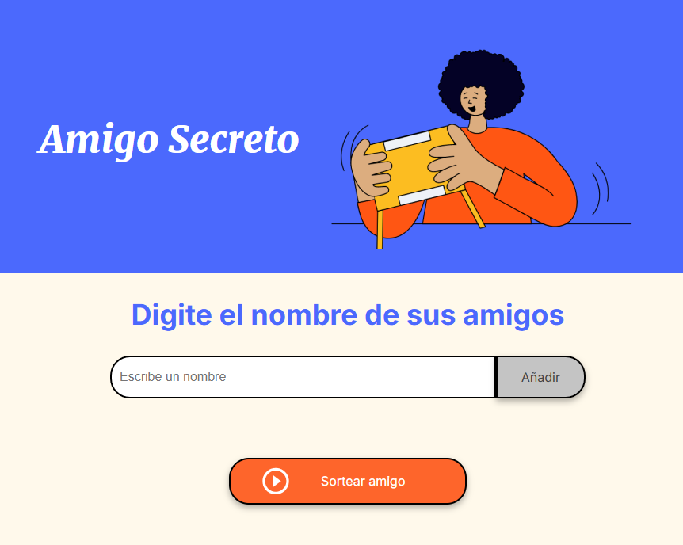
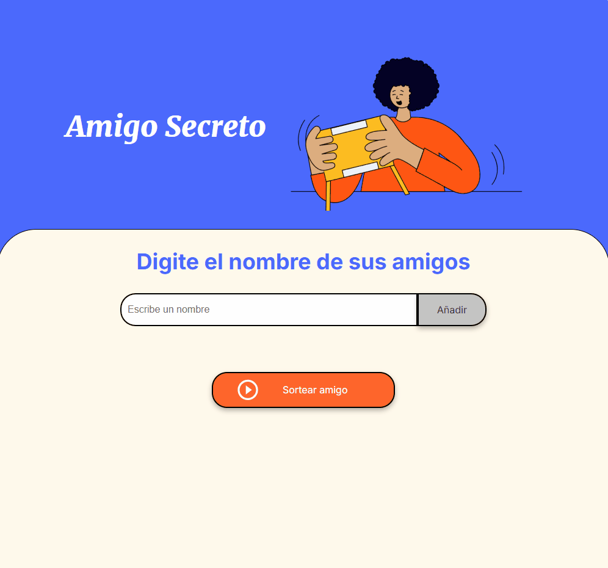

# 🎁 Amigo Secreto - Sorteo Automático  
  

## 📌 Índice  
- [Descripción del proyecto](#-descripción-del-proyecto)  
- [Estado del proyecto](#-estado-del-proyecto)  
- [Características de la aplicación y demostración](#-características-de-la-aplicación-y-demostración)  
- [Acceso al proyecto](#-acceso-al-proyecto)  
- [Tecnologías utilizadas](#-tecnologías-utilizadas)  
- [Personas Contribuyentes](#-personas-contribuyentes)  
- [Personas Desarrolladoras del Proyecto](#-personas-desarrolladoras-del-proyecto)  
- [Licencia](#-licencia)  
- [Conclusión](#-conclusión)  

## 🏆 Insignias  
  
  

## 📝 Descripción del proyecto  
**"Amigo Secreto - Sorteo Automático"** es una aplicación web interactiva que permite a los usuarios agregar nombres y realizar un sorteo de amigo secreto de manera aleatoria.  

**Objetivo:**  
✅ Facilitar la dinámica del juego.  
✅ Evitar el proceso manual.  
✅ Garantizar una asignación justa y divertida.  

## 🚦 Estado del proyecto  
📌 **Versión 1.0 - Completado ✅**  

✔️ Funcionalidad principal implementada.  
✔️ Interfaz básica con **HTML, CSS y JavaScript**.  
✔️ Lógica de sorteo optimizada.  

🚀 **Próximas mejoras:**  
🔹 Guardado de nombres en **localStorage**.  
🔹 Estilos mejorados con **animaciones CSS**.  
🔹 Integración con una **API para almacenar sorteos**.  

## ✨ Características de la aplicación y demostración  
✅ **Añadir nombres:** Permite a los usuarios ingresar amigos en la lista.  
✅ **Mostrar lista:** Se visualizan los participantes antes del sorteo.  
✅ **Realizar sorteo:** Un participante es seleccionado aleatoriamente.  
✅ **Reiniciar sorteo:** Se limpia la lista después del sorteo.  

### 🎬 DEMOSTRACIÓN  
  

## 🔗 Acceso al proyecto  
Puedes acceder al proyecto desde este enlace:  
🔗 [Repositorio en GitHub](https://github.com/victorjeanpierre/challenge-amigo-secreto.git)  

## 🛠️ Tecnologías utilizadas  
- **HTML5**  
- **CSS3**  
- **JavaScript**  

## 🤝 Personas Contribuyentes  
Este proyecto está abierto a contribuciones. Si deseas mejorar la funcionalidad, envía un **Pull Request** o reporta un problema en la sección de **Issues**.  

## 👨‍💻 Personas Desarrolladoras del Proyecto  
- **Victor Curipaco Marquez**  
📧 Contacto: [jeanpierrecuripaco@gmail.com](mailto:jeanpierrecuripaco@gmail.com)  

## 📜 Licencia  
Este proyecto está bajo la **Licencia MIT**, lo que significa que puedes usarlo, modificarlo y distribuirlo libremente.  

## ✅ Conclusión  
*"Amigo Secreto - Sorteo Automático"* es una herramienta sencilla y efectiva para organizar sorteos sin complicaciones. Gracias a su implementación con JavaScript, permite un funcionamiento dinámico y eficiente.  

📢 **Si tienes ideas para mejorar la aplicación, tu feedback es bienvenido! 🚀**  
